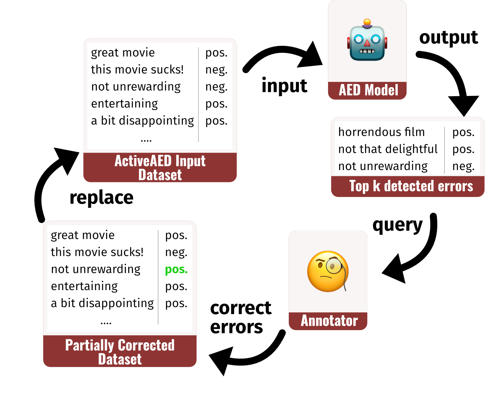

# ActiveAED: A Human in the Loop Improves Annotation Error Detection

## Overview

This repository contains the code for the paper "ActiveAED: A Human in the Loop Improves Annotation Error Detection". The goal of ActiveAED is to improve the performance of Annotation Error Detection (AED) models by involving a human annotator in the prediction loop.




## Requirements

- Python 3.9 or higher
- PyTorch 1.9 or higher
- NumPy
- scikit-learn
- tqdm
- transformers
- datasets

To install the required packages, run:

```bash
pip install -r requirements.txt
```

## Training

To train and evaluate an ActiveAED model, run:

```bash
python token_classification.py --out_dir [OUT_DIR] --dataset [DATASET_NAME] --scorer [SCORER_NAME] --n_epochs [N_EPOCHS] --seed [SEED]
```

or

```bash
python sequence_classification.py --out_dir [OUT_DIR] --dataset [DATASET_NAME] --scorer [SCORER_NAME] --n_epochs [N_EPOCHS] --seed [SEED]
```

Example:

```bash
python token_classification.py --out_dir runs/flights_activeaed_1 --dataset inconsistencies_flights --scorer aum --n_epochs 40 --seed 1
```

The script will save the resulting scores in `[OUT_DIR]/results.csv`.

For reproducing the results in the paper, see `experiments.sh`.


## License

This project is licensed under the MIT License. See the `LICENSE` file for more information.